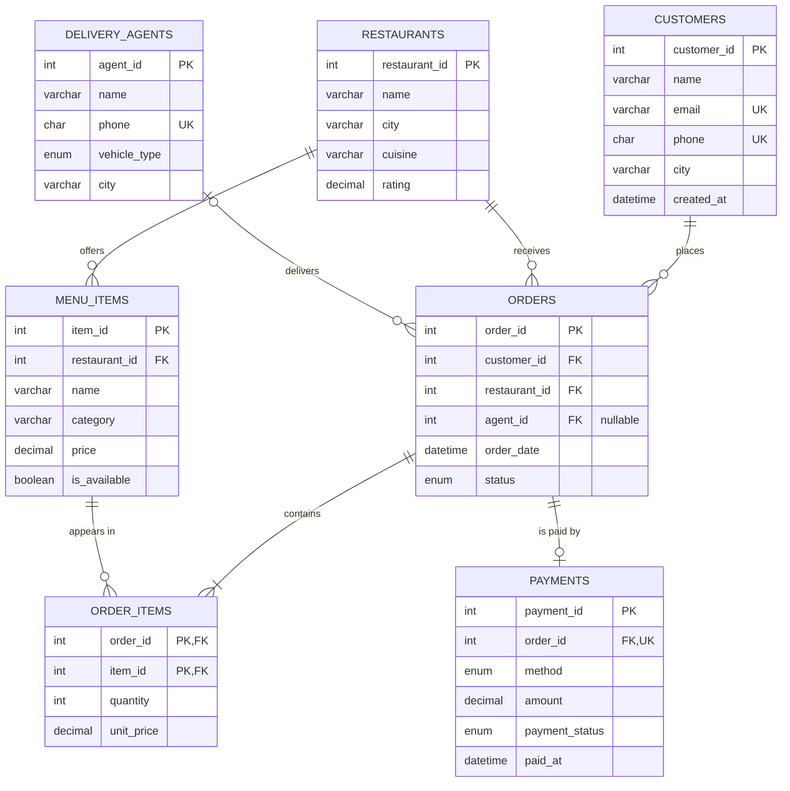

# 🍔 Online Food Delivery Database (MySQL)

A DBMS course project that models an online food-ordering platform: customers order from restaurants,
delivery agents deliver, and payments are recorded. The design is normalized to **BCNF** and implemented in **MySQL 8**.

## What is inside

| Requirement | Where |
|---|---|
| 7 tables with PK / FK / CHECK / UNIQUE constraints | [`sql/01_schema.sql`](sql/01_schema.sql) |
| Sample data | [`sql/02_sample_data.sql`](sql/02_sample_data.sql) |
| Views, stored function, stored procedure, trigger | [`sql/03_views_procedures_triggers.sql`](sql/03_views_procedures_triggers.sql) |
| 18 SQL queries + DML / transaction demos | [`sql/04_queries.sql`](sql/04_queries.sql) |
| Normalization (UNF → 1NF → 2NF → 3NF → BCNF) | [`docs/normalization.md`](docs/normalization.md) |
| 12 relational algebra examples with SQL | [`docs/relational_algebra.md`](docs/relational_algebra.md) |

## ER diagram



### Relationships in words

| Relationship | Cardinality | Implemented by |
|---|---|---|
| Customer places Order | 1 : N | `orders.customer_id` |
| Restaurant receives Order | 1 : N | `orders.restaurant_id` |
| Restaurant offers Menu Item | 1 : N | `menu_items.restaurant_id` |
| Delivery Agent delivers Order | 1 : N (optional) | `orders.agent_id` (nullable) |
| Order contains Menu Items | **M : N** | junction table `order_items` |
| Order is paid by Payment | 1 : 1 (optional) | `payments.order_id` UNIQUE |


## Relational schema

```
customers       (customer_id PK, name, email UK, phone UK, city, created_at)
restaurants     (restaurant_id PK, name, city, cuisine, rating)
menu_items      (item_id PK, restaurant_id FK→restaurants, name, category, price, is_available)
delivery_agents (agent_id PK, name, phone UK, vehicle_type, city)
orders          (order_id PK, customer_id FK→customers, restaurant_id FK→restaurants,
                 agent_id FK→delivery_agents NULL, order_date, status)
order_items     (order_id FK→orders, item_id FK→menu_items, quantity, unit_price)  PK(order_id, item_id)
payments        (payment_id PK, order_id FK→orders UK, method, amount, payment_status, paid_at)
```

## How to run

Requires **MySQL 8.0.16 or later** (CHECK constraints are enforced from 8.0.16; window function query Q15 needs 8.0+).

```bash
git clone https://github.com/manya296/food-delivery-dbms.git
cd food-delivery-dbms

mysql -u root -p < sql/01_schema.sql
mysql -u root -p < sql/02_sample_data.sql
mysql -u root -p < sql/03_views_procedures_triggers.sql
mysql -u root -p < sql/04_queries.sql      # or paste queries one by one in MySQL Workbench
```

Or in the MySQL shell: `SOURCE sql/01_schema.sql;` and so on, in the same order.

## Features demonstrated

* **Constraints:** primary keys, composite key, foreign keys with `CASCADE` / `RESTRICT` / `SET NULL`, `UNIQUE`, `CHECK`, `ENUM`, `DEFAULT`, `NOT NULL`
* **Queries:** joins (inner, left, self), aggregates, `GROUP BY` / `HAVING`, subqueries, `NOT EXISTS`, window function `RANK()`, relational division
* **Programmability:** 2 views, 1 stored function, 1 stored procedure with a transaction, 1 trigger
* **Transactions:** `START TRANSACTION` / `ROLLBACK`, row locking with `FOR UPDATE`
* **Performance:** secondary indexes plus an `EXPLAIN` demo

## Sample data snapshot

8 customers · 5 restaurants · 15 menu items · 4 delivery agents · 12 orders · 24 order lines · 12 payments

## Possible extensions

* Separate `cities` and `categories` tables
* Reviews / ratings table per order
* Coupons and discounts
* A Python or Node front end that calls these queries

## License

MIT: free to use for learning.
